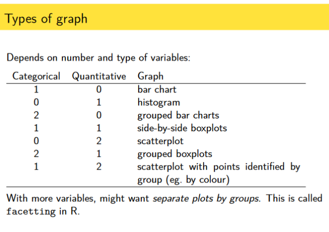

## Text Analysis

- General:

  - Text Analysis and text mining are the same process: They focus on qualitative results
  - Text Analytics: Focus on quantitative results
  - Collocation terms: Words that often go together so that it generates information based on context
  - Stemming: Reducing words to their root form and determining relevance

&nbsp;

- Types of text analysis:

  - Sentiment Analysis: positive, neutral and negative opinions
  - Subjectivity Analysis: tags the data if it is
  - Topic classification: organizing opinions by subject (takes text as input and gives it a pre-defined tag)
  - Can combine multiples of the previous type (see metrics below)

&nbsp;

- Metrics:

  - Bold: Will be used
  - Italic: Future use if we have time
  - Crossed: Not going to be used

  1. ~~Number of comments~~: Will not go with this one because percentages are better
  2. **Percentage of comments**: Will be using this in the following metrics
  3. **Sentiment of comments**: Will definitely be using this
  4. **Subjectivity Analysis of comments**: I think this is good since it's simple and a lot of people will want to use this info for feedback
  5. _Further Classification Dissection_: by subjectivity analysis _and_ by sentiment analysis
  6. _Topic classification of comments_: Will have it in the database but will not use it for now

&nbsp;

- Time period:

  - Automatically on the last month
  - Implications:
    - Will mean that need to add handler when the user didn't post in the last month
    - Or we need to check when was the last time they made a post and default it to that month

&nbsp;

- Chart Types: (ones that we are going to use)

  - Pie Charts
  - Grouped Bar Charts
  - Word Clouds
  - Time Series

&nbsp;

- Charts:

  - Per Platform: (From simplest to most complex)

    - Pie chart:

      These will be 3 tiles:

      1. Percentage per sentiment classification
      2. Percentage per subjectivity classification
      3. Word cloud with

    - Grouped Bar Chart:
      Each will be a separate row:

      1. Grouped sentiment bar chart for each post (groups: positive, negative and neutral)
      2. Grouped subjectivity analysis bar chart for each post (groups: subjective and objective)

      - Posts will be ordered by published date in descending order from right to left

      - On-click word clouds:

        - When they click on a section of the bar chart, it shows a word cloud of the keywords of those reviews
        - **Alternative**:
          - Reasoning: having text appear in the word cloud as a pop-up might be bad since that's incorrect use of a popup since popups are not used to show data
          - Solution: we have a chart that appears to the left and pushes everything back once a user clicks on a segment of a bar chart

  - Per video/post:

    - Tiles:

      - Views
      - Likes
      - Comments

    - Pie chart:

      1. Percentage per sentiment classification

         - **Issues**: repetition of the previous bar graph

      2. Percentage per subjectivity classification

         - **Issues**: repetition of the previous bar graph

    &nbsp;

- General/Overview Performance:

  - General metric to see how well you are doing across all platforms
  - Most liked video
  - Most positive comments video

&nbsp;

- Other resources:

  - How to pick graph type:

    
