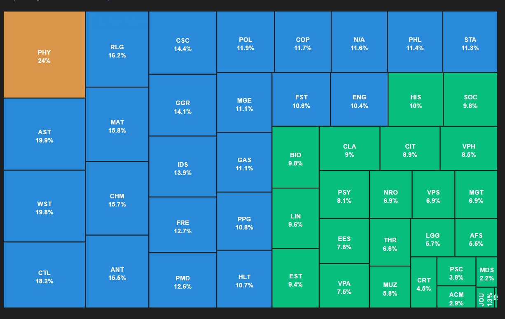

## Customer Feedback Aggregation

### Data Sources

1. Surveys, e.g. google forms
2. Interviews - speech to text and emails
3. Social Media - facebook, twitter, reddit and instagram (what people are commenting and saying)
4. Customer reviews - google my business, facebook reviews, yelp, yellow pages or amazon
5. Website performance tools - hot jar, log rocket and google analytics

### How it will be uploaded to our website

1. Social Media

- Facebook:

  - Link to facebook api to get access to:

    - Comments on their pages as well
    - Mentions to other pages

  - This can be done through the [Graphs API](https://developers.facebook.com/docs/graph-api/overview)

- Instagram:

  - Link to instagram api to get access to:

    - Comments on their pages as well
    - Mentions to other pages
    - Hashtags of their interest to load data into our server from

  - This can be done through the [Instagram Graphs API](https://developers.facebook.com/docs/instagram-api/)

- Twitter:

  - Link to twitter api to get access to:

    - Requires further research

  - The twitter [API](https://developer.twitter.com/en/docs/twitter-api/getting-started/getting-access-to-the-twitter-api)

- Reddit:

  - Link to reddit api to get access to:

    - Posts in the threads, etc.

  - Done through the reddit [API](https://www.reddit.com/r/TheoryOfReddit/wiki/collecting_data/) which is easy to use

2. Customer reviews

- Google Business

  - Google is the first place for search and people can set up business profiles [here](https://www.google.com/business/)
  - There is an API to get all the reviews [here](https://developers.google.com/my-business/content/review-data#before_you_begin)

- Yelp

  - API access [here](https://www.yelp.com/developers/documentation/v3/business_reviews)

- Facebook reviews: skip for now since this is proof of concept
- Yellow Pages: skip for now since this is proof of concept
- Amazon: skip for now since this is proof of concept

3. Website performance software

- Google Analytics: has an API so it is possible - [here](https://developers.google.com/analytics/devguides/reporting/core/v4)
- Hot Jar: they allow an integration with Postgresql db (not sure if possible tho)
- Log Rocket: not possible to export the data into a separate dashboard

4. Surverys:

- If the information is available in Excel then Excel uploads are available in the given format so that users can upload the data to be stored onto the website
- Google forms can be used to automate surverys, gather responses, analyze and export the responses [Google Forms API](https://developers.google.com/forms/api)

5. Interviews and emails

- These can be uploaded through a form submission on the website
- Another possible feature: they can have a dedicated email that they forward any feedback and the content will automatically be uploaded to the website.

### Features - Text Analysis and Text Mining (aka NLP)

1. Most used words in the texts for example in a custom aggregation of selected sources, e.g. most common words in social media (there are ways to filter out filler words and slangs)

2. Sentiment Analysis - Understand the overall sentiment expressed in a block of text which can be done through the google api [here](https://cloud.google.com/natural-language/pricing)

3. Data can be available for excel downloads with the text of analysis and the source

4. Possible Charts:

- Heat map chart to show case where all the feedback is coming from
- Heat map chart to show case where the most negative comments are vs the most positive comments

5. Content Classification

- Uses AI to group the reviews in a similar fashion due to similarity
- Then we can do word count charts for every single cluster classification

6. Provide our own API's that developers can use to upload the data that they get from other platforms too, for example in Amor, I am assuming that there is going to be a form of customer feedback and we provide a method to make an integration between our platform and amor. This can also be used to send live chat transcripts

## Some markets that need this the most (taken from my customer lens startup competitor below)

1. Law firms
2. Accounting firms
3. Consultant Agencies

## What are Hot Jar?

- Allows you to draw heat maps on your website so that you can see the user experience
- Can export this data to other websites through integrations to see the analysis - It does this through Zapier for automation
- Records sessions so that you can see user activity
- Has a side feedback feature for the user to enter what they think of the website

  

- Has heatmaps to see where the users are clicking for the most part
- Has surveys that you can pull customer data from

- Issue: it doesn't pull all possible sources of customer feedback

- Next steps: does it have an API?
- Answer: using Zapier, it can be integrated with PostgreSQL

## Log Rocket

- Similar to above but with
- Records sessions for a customer
- Can possibly connect to log rocket with their API

## Competitors

- My Customer Lens

  - Does the exact same thing as our website and based on Scotland [here](https://mycustomerlens.com/about-mycustomerlens-team/)

- Sales Force (in social media which you also need to buy)

  - Provides many services from spreadsheets to managing customer services to managing marketing campaigns and analyzing the sales data

  - Spreadsheets: similar to Excel but with more features, such as limiting what can be entered into the cells and an admin can change the visibility of certain columns or rows to each user

  - Customer services:

    - When a customer reaches out to a company to talk, this is done through sales force
    - Has social media plug ins and analytics so they can communicate with customers and reply to what customers say

  - Marketing: can control your campaign from there

  - Sales: can see an analysis of your sales and thus judge the marketing that was done

  - Other notable features: allows for customization in terms of coding your own dashboards in their own langauges

  - It is a business to business company model

  - Has no real competitors on

  - Disadvantages:

    - Very costly

  - 

- Sales Froce competitors to see if they offer what we are aiming to offer:

  - #1 Competitor: Zoho, they give a blunt comparison between the two services [here](https://www.zoho.com/crm/compare/salesforce.html?src=number-one-alternative)
  - Competitor for us from a social media perspective

  - Microsoft Dynamics 365:

    - Costs $1,500 per user (very expensive)
    - Offers a complete views of customers: who they are, how they feel and what they are doing

      - Who: Uses third party data to get information on customers
      - How: sentiment analysis on feedback and direct survery feedback
      - What: interactions with the website and connected products
      - Some blurred charts with what they offer with the data:

    - Customer data that they use: transactional, behavioural or demographics

## Other Citations

- 9 Ways to Collect Customer Feedback - https://www.youtube.com/watch?v=nHpqGCQfVys
- Best ways to collect customer feedback from digital sources - https://www.youtube.com/watch?v=TFQOhPM1a_E
- What is customer feedback and 5 ways to collect it! - https://www.youtube.com/watch?v=qKqg77ZpMuU
- HotJar Tutorial for Beginners - https://www.youtube.com/watch?v=7cU6QQbk9M8
- Introduction to Salesforce - https://www.youtube.com/watch?v=qGNjRT7F-2Y
- Salesforce capability - https://www.salesforce.com/ca/form/sem/demo/salesforce-products/?d=7010M000000uCEoQAM&nc=7010M000000ulMz&DCMP=KNC-Google&ef_id=Cj0KCQjwvqeUBhCBARIsAOdt45Y_7tUpgYxOB-TjyW9honjYqmENpEbgKxZyaYf4JWKifErf-6MLP00aAplGEALw_wcB:G:s&s_kwcid=AL!5408!3!520343314452!b!!g!!%2Bsalesforce&pcrid=520343314452&pdv=c
- Survey tool to be used in addition to sales force - https://www.getfeedback.com/resources/cx/customer-feedback-salesforce-surveys/#:~:text=Housing%20customer%20feedback%20in%20Salesforce,%2C%20pipeline%2C%20and%20case%20volume.
- Text Analysis - https://www.youtube.com/watch?v=726zIGShyPg
